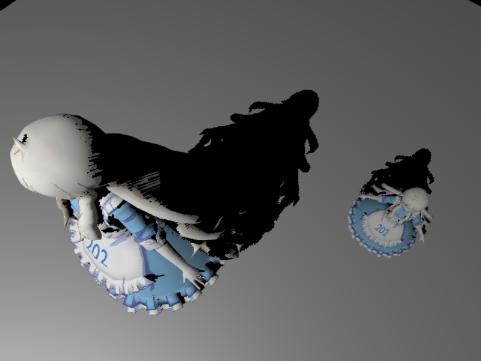
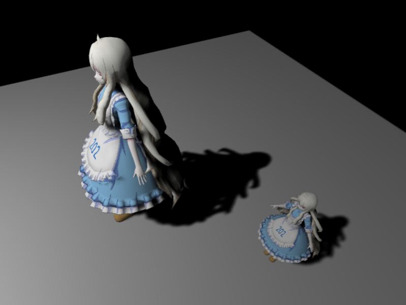
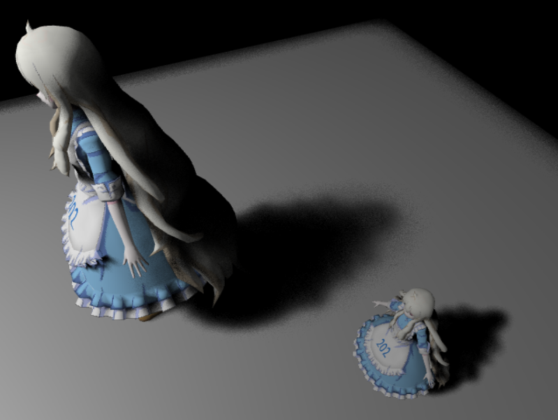
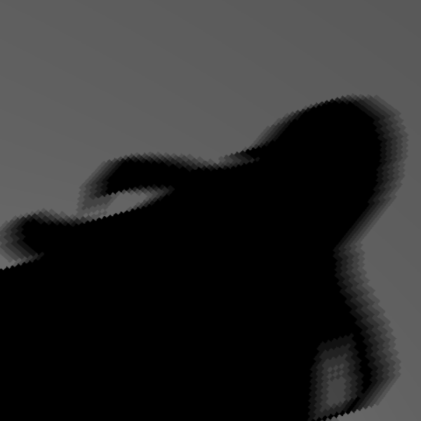
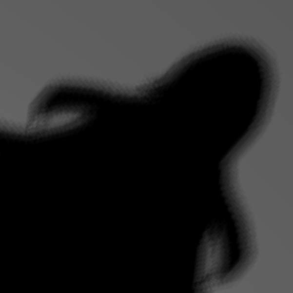
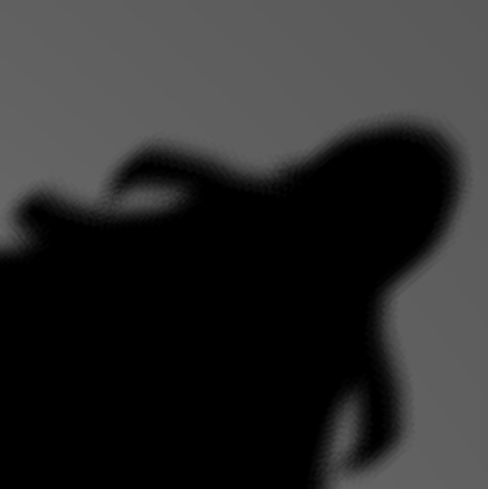
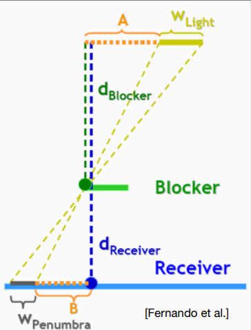
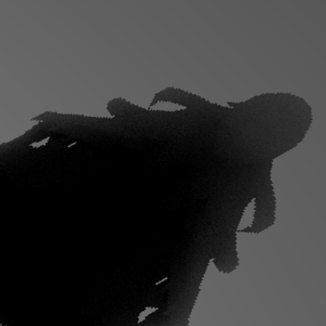
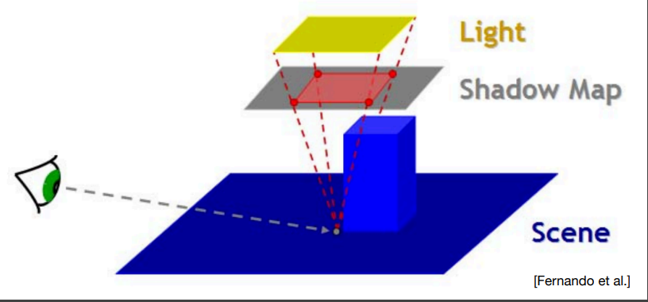

# PCF and PCSS Shadow
This repo is the homework1 of GAMES202, which implements **hard shadow map**, **PCF shadow**, and **PCSS shadow**. And this markdown explains some implementaion details.

## Overview
**Hard shadow map** produces hedious edges, this is due to the **limited resolution of shadow map**(usually lower than the camera pass screen resolution). 

One way to alleviate these effect is to use a filter to smooth the jagged edges, which is the PCF method.

However, hard shadow and PCF shadow both produces shadow almost **solid dark everywhere**. But in real life, we see shadow with **gradient brightness on the edge**, this is mainly because light in real life is **emitted from a surface**, not an ideal point, this produces penumbra, e.g., partial lunar eclipse v.s. total lunar eclipse.

PCSS simulates the penumbra effect with a variable filter radius, which gives a rather good result.

## Sampling in PCF matters
The shadow effect varies from sampling methods.

**Block sampling**

*num_sample=24, block_width=6.0/2048.0*

Block sampling just copies the jagged edges in gradient brightness, it does not really smooth the edges well. This is due to the block filter's **anisotropy**, it kind of **reserves the descrete directional change** in the original edge.

**Uniform sampling**

*num_sample=24, block_width=4.0/2048.0*

Uniform sampling is isotropic, so it blurs the edges well, but it **does not reserve the original shape well** compared to poisson sampling.

**Poisson sampling**

*num_sample=24, block_width=4.0/2048.0*

Poisson sampling is also isotropic, but the sample points get denser in the center, sparser away from the center. So it smooth the jagged edge and also, **reserves the shadow shape** well. 
(Points closer to the sample center blur together, points away from the center do not contribute that much.)

## PCSS shadow
### PCF radius

$$w_{penumbra} = \frac{d_{receiver} - d_{blocker}} {d_{blocker}} w_{light}$$
This gives the penumbra radius on the receiver plane **in world coordinate**, but we need to sample **in shadow map coordinate** in range $[0,1]$.So we need to convert the radius to the texture coordinate.

Assume we are using perspective projection from the light view. Then the radius in the frustum is:
$$w_{p,frustum} = \frac{d_{near}}{d_{receiver}}w_{penumbra}$$
Then the frustum is transformed to the $[0,1]^{2}$ texture map coordinate with a scale of one over frustum width:
$$w_{p,texture}= \frac{1}{w_{frustum}}w_{p,frustum}$$
So we finally get the penumbra radius in texture coordinate:
$$w_{p,texture} = \frac{d_{near}(d_{receiver} - d_{blocker})w_{light}} {d_{blocker}d_{receiver}w_{frustum}}$$

### Blocker search radius
Why do we need averaged blocker distance? 
If we just use the exact blocker distance just like hard shadow sample, the result is like this:

We do have gradient brightness on the edge, but the shadow is not blured, because once a pixel is not blocked, it receives full lighting. We want those pixels close to the edge also get involed in PCF filtering, using an averaged blocker distance in a certain region could fix this.

But how do we know the region radius to block search? Search the blockers between the surface light and the receiver is resonable:

Using the same projection method in the previous section, the search radius is:
$$w_{search} = \frac{(d_{receiver}-d_{near})w_{light}}{d_{receiver}w_{frustum}}$$

